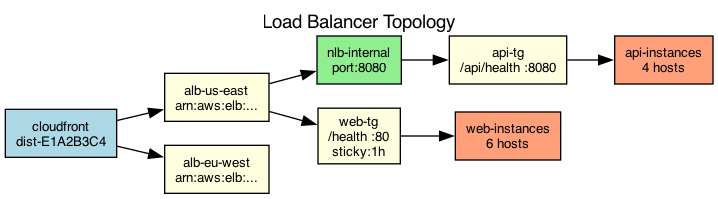

## Overview

The web application uses a three-tier load balancing architecture with a global load balancer, regional application load balancers, and service-level load balancers.

## Details

Refer to the diagram above for specific configuration details, component names, and measured values.
