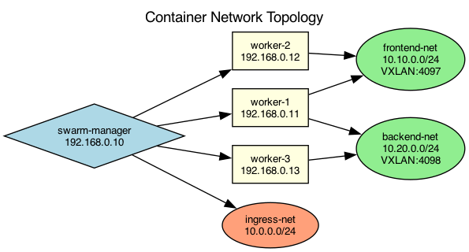

## Overview

The Docker Swarm cluster uses overlay networks to isolate service communication. Frontend services communicate with backend services through a dedicated overlay network.

## Details

Refer to the diagram above for specific configuration details, component names, and measured values.
