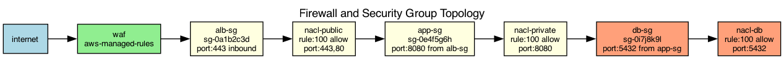

## Overview

The network security architecture uses layered controls with AWS security groups, NACLs, and a WAF. Traffic inspection is performed at each layer.

## Details

Refer to the diagram above for specific configuration details, component names, and measured values.
