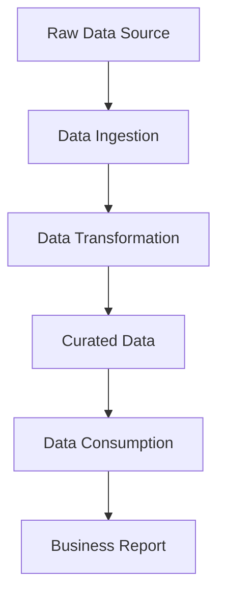

## Data Lake Architecture

A data lake is a centralized repository that allows you to store all your structured and unstructured data at any scale. Unlike a traditional data warehouse, which is designed for specific, predefined use cases, a data lake is a more flexible and scalable approach to data storage and processing.

The key components of a data lake architecture include:

### Ingestion Layer
The ingestion layer is responsible for bringing data into the data lake from various sources. This can include batch data, streaming data, and real-time data. Common ingestion tools include Apache Kafka, Apache Spark Streaming, AWS Kinesis, and Azure Event Hubs.

Example Kafka ingestion configuration:
```yaml
bootstrap.servers=kafka-broker1:9092,kafka-broker2:9092
key.serializer=org.apache.kafka.common.serialization.StringSerializer
value.serializer=org.apache.kafka.common.serialization.StringSerializer
```

### Storage Layer
The storage layer is the foundation of the data lake, where the raw, unprocessed data is stored. This layer is typically implemented using object storage services like Amazon S3, Azure Blob Storage, or Google Cloud Storage. These services provide scalable, durable, and cost-effective storage for large volumes of data.

Example AWS S3 bucket configuration:
```json
{
    "Version": "2012-10-17",
    "Statement": [
        {
            "Effect": "Allow",
            "Principal": {
                "AWS": "*"
            },
            "Action": "s3:GetObject",
            "Resource": "arn:aws:s3:::my-data-lake/*"
        }
    ]
}
```

### Processing Layer
The processing layer is responsible for transforming and enriching the raw data stored in the data lake. This layer typically includes tools like Apache Spark, Apache Flink, AWS Glue, or Azure Databricks, which can be used to perform batch and stream processing tasks.

Example Apache Spark job:
```python
from pyspark.sql.functions import col, lit
from pyspark.sql.types import StructType, StructField, StringType

schema = StructType([
    StructField("id", StringType(), True),
    StructField("name", StringType(), True),
    StructField("age", StringType(), True)
])

df = spark.read.format("parquet").load("s3://my-data-lake/raw/users")
df = df.withColumn("processed_at", lit(current_timestamp()))
df.write.format("parquet").save("s3://my-data-lake/curated/users")
```

### Consumption Layer
The consumption layer provides access to the transformed and enriched data stored in the data lake. This layer can include tools like Apache Hive, Presto, or Athena, which allow users to query the data using SQL-like syntax. Additionally, this layer can integrate with business intelligence (BI) tools like Tableau, Power BI, or Looker for data visualization and analysis.

Example Presto query:
```sql
SELECT name, age
FROM my_data_lake.curated.users
WHERE age > 30
```

### Metadata Catalog
The metadata catalog is a critical component of the data lake architecture, as it provides a centralized source of information about the data stored in the lake. This includes details about the data's origin, structure, quality, and lineage. A robust metadata catalog can be built using tools like Apache Atlas, AWS Glue Data Catalog, or Azure Data Catalog.

Example Apache Atlas entity definition:
```json
{
  "entity": {
    "typeName": "hive_table",
    "attributes": {
      "name": "users",
      "description": "Table containing user information",
      "owner": "data-team",
      "parameters": {
        "comment": "User data table"
      },
      "tableType": "MANAGED_TABLE",
      "lastAccessTime": 1618924800000,
      "retention": 0,
      "sd": {
        "inputFormat": "org.apache.hadoop.mapred.TextInputFormat",
        "outputFormat": "org.apache.hadoop.hive.ql.io.HiveIgnoreKeyTextOutputFormat",
        "location": "s3://my-data-lake/curated/users",
        "serdeInfo": {
          "serializationLib": "org.apache.hadoop.hive.serde2.lazy.LazySimpleSerDe"
        },
        "bucketCols": [],
        "sortCols": [],
        "parameters": {
          "pat imesFlag": "true",
          "serialization.format": "1"
        }
      }
    },
    "guid": "4711d660-1234-5678-abcd-123456789abc",
    "status": "ACTIVE"
  }
}
```

## Data Lake Zones

A well-designed data lake should be organized into distinct zones to facilitate data management, processing, and governance. The main zones in a data lake architecture are:

### Raw Zone
The raw zone is the initial landing area for all incoming data. This zone stores the data in its original, unprocessed form, preserving the data's integrity and lineage. The raw zone is typically implemented using a distributed file system or object storage, and the data is often stored in a self-describing format like Parquet or Avro.

Example raw zone directory structure:
```
s3://my-data-lake/raw/
├── data-source-1/
│   ├── 2023/
│   │   ├── 01/
│   │   │   ├── part-00001.parquet
│   │   │   └── part-00002.parquet
│   │   └── 02/
│   │       └── part-00001.parquet
│   └── 2024/
│       └── 01/
│           └── part-00001.parquet
└── data-source-2/
    ├── 2023/
    │   └── 03/
    │       ├── part-00001.parquet
    │       └── part-00002.parquet
    └── 2024/
        └── 01/
            └── part-00001.parquet
```

### Curated Zone
The curated zone is where the raw data is transformed, enriched, and organized for analysis and consumption. This zone typically contains data that has been cleansed, validated, and structured to meet specific business requirements. The data in the curated zone is often partitioned and indexed to optimize query performance.

Example curated zone directory structure:
```
s3://my-data-lake/curated/
├── users/
│   ├── country=us/
│   │   ├── year=2023/
│   │   │   ├── month=01/
│   │   │   │   └── part-00001.parquet
│   │   │   └── month=02/
│   │   │       └── part-00001.parquet
│   │   └── year=2024/
│   │       └── month=01/
│   │           └── part-00001.parquet
│   └── country=uk/
│       ├── year=2023/
│       │   └── month=03/
│       │       └── part-00001.parquet
│       └── year=2024/
│           └── month=01/
│               └── part-00001.parquet
└── orders/
    ├── year=2023/
    │   ├── month=01/
    │   │   └── part-00001.parquet
    │   └── month=02/
    │       └── part-00001.parquet
    └── year=2024/
        └── month=01/
            └── part-00001.parquet
```

### Consumption Zone
The consumption zone is the area of the data lake where data is made available for end-users and business intelligence (BI) tools. This zone typically contains data that has been optimized for specific use cases, such as data marts or views. The data in the consumption zone is often pre-aggregated, filtered, and formatted to improve query performance and ease of use.

Example consumption zone directory structure:
```
s3://my-data-lake/consumption/
├── sales_dashboard/
│   ├── sales_by_product.parquet
│   └── sales_by_region.parquet
└── finance_reports/
    ├── revenue_by_quarter.parquet
    └── expenses_by_department.parquet
```

## Metadata Catalog

A metadata catalog is a crucial component of a data lake architecture, as it provides a centralized source of information about the data stored in the lake. The metadata catalog can include details about the data's origin, structure, quality, and lineage, as well as information about the data's usage and access permissions.

There are several tools available for building a metadata catalog, including:

### Apache Atlas
Apache Atlas is an open-source metadata management and governance framework that can be used to build a comprehensive metadata catalog for a data lake. Atlas supports a wide range of data sources, including Hadoop, Hive, Kafka, and relational databases, and provides features for data classification, lineage tracking, and policy enforcement.

Example Atlas entity definition:
```json
{
  "entity": {
    "typeName": "hive_table",
    "attributes": {
      "name": "users",
      "description": "Table containing user information",
      "owner": "data-team",
      "parameters": {
        "comment": "User data table"
      },
      "tableType": "MANAGED_TABLE",
      "lastAccessTime": 1618924800000,
      "retention": 0,
      "sd": {
        "inputFormat": "org.apache.hadoop.mapred.TextInputFormat",
        "outputFormat": "org.apache.hadoop.hive.ql.io.HiveIgnoreKeyTextOutputFormat",
        "location": "s3://my-data-lake/curated/users",
        "serdeInfo": {
          "serializationLib": "org.apache.hadoop.hive.serde2.lazy.LazySimpleSerDe"
        },
        "bucketCols": [],
        "sortCols": [],
        "parameters": {
          "pat imesFlag": "true",
          "serialization.format": "1"
        }
      }
    },
    "guid": "4711d660-1234-5678-abcd-123456789abc",
    "status": "ACTIVE"
  }
}
```

### AWS Glue Data Catalog
AWS Glue Data Catalog is a metadata repository service provided by Amazon Web Services (AWS) that can be used to build a metadata catalog for a data lake stored in Amazon S3. The Glue Data Catalog supports a wide range of data sources, including relational databases, NoSQL databases, and streaming data sources, and provides features for data discovery, data classification, and data lineage tracking.

Example Glue Data Catalog table definition:
```json
{
  "Name": "users",
  "Description": "Table containing user information",
  "Owner": "data-team",
  "LastAccessTime": "2023-04-18T12:00:00Z",
  "Retention": 0,
  "StorageDescriptor": {
    "Columns": [
      {
        "Name": "id",
        "Type": "string"
      },
      {
        "Name": "name",
        "Type": "string"
      },
      {
        "Name": "age",
        "Type": "int"
      }
    ],
    "Location": "s3://my-data-lake/curated/users",
    "InputFormat": "org.apache.hadoop.mapred.TextInputFormat",
    "OutputFormat": "org.apache.hadoop.hive.ql.io.HiveIgnoreKeyTextOutputFormat",
    "SerdeInfo": {
      "SerializationLibrary": "org.apache.hadoop.hive.serde2.lazy.LazySimpleSerDe"
    },
    "Parameters": {
      "pat imesFlag": "true",
      "serialization.format": "1"
    }
  },
  "TableType": "EXTERNAL_TABLE",
  "Parameters": {
    "comment": "User data table"
  }
}
```

### Azure Data Catalog
Azure Data Catalog is a fully managed metadata catalog service provided by Microsoft Azure. It can be used to register, describe, and discover data assets from a wide range of data sources, including Azure Blob Storage, Azure Data Lake Storage, and Azure SQL Database. The Data Catalog provides features for data discovery, data lineage tracking, and data governance.

Example Azure Data Catalog asset definition:
```json
{
  "description": "Table containing user information",
  "schemaInfo": {
    "columns": [
      {
        "name": "id",
        "type": "string"
      },
      {
        "name": "name",
        "type": "string"
      },
      {
        "name": "age",
        "type": "integer"
      }
    ]
  },
  "location": "https://mystorageaccount.blob.core.windows.net/my-data-lake/curated/users",
  "dataAsset": {
    "name": "users",
    "type": "table"
  },
  "owner": "data-team",
  "tags": [
    "user_data",
    "customer_information"
  ]
}
```

## Data Governance

Data governance is a critical component of a successful data lake architecture, as it ensures the data stored in the lake is managed and controlled in a way that meets the organization's business and regulatory requirements.

Key aspects of data governance in a data lake include:

### Data Classification
Data classification involves categorizing data assets based on their sensitivity, criticality, and value to the organization. This information is used to apply appropriate security, access, and retention policies to the data.

Example data classification policy:
```
{
  "classifications": [
    {
      "name": "public",
      "description": "Non-sensitive data that can be shared publicly",
      "security_level": 1
    },
    {
      "name": "internal",
      "description": "Sensitive data that can be accessed by authorized employees only",
      "security_level": 3
    },
    {
      "name": "confidential",
      "description": "Highly sensitive data that can only be accessed by a small number of authorized personnel",
      "security_level": 5
    }
  ]
}
```

### Access Control
Access control ensures that only authorized users and processes can access and modify the data stored in the data lake. This can be implemented using role-based access control (RBAC) or attribute-based access control (ABAC) policies.

Example RBAC policy:
```
{
  "version": "2012-10-17",
  "statement": [
    {
      "effect": "allow",
      "principal": {
        "aws": "arn:aws:iam::123456789012:role/data-analyst"
      },
      "action": [
        "s3:GetObject",
        "s3:ListBucket"
      ],
      "resource": [
        "arn:aws:s3:::my-data-lake/curated/*",
        "arn:aws:s3:::my-data-lake"
      ]
    },
    {
      "effect": "deny",
      "principal": {
        "aws": "arn:aws:iam::123456789012:role/data-analyst"
      },
      "action": [
        "s3:DeleteObject",
        "s3:PutObject"
      ],
      "resource": [
        "arn:aws:s3:::my-data-lake/curated/*"
      ]
    }
  ]
}
```

### Data Lineage
Data lineage tracks the origin, transformation, and usage of data assets within the data lake. This information is crucial for understanding the data's provenance, ensuring data quality, and meeting regulatory requirements.

Example data lineage visualization:


### Data Quality
Data quality assurance involves implementing processes and tools to ensure the data stored in the data lake is accurate, complete, and consistent. This can